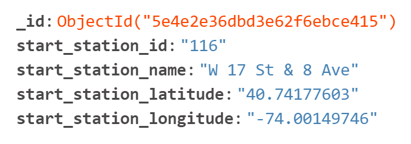
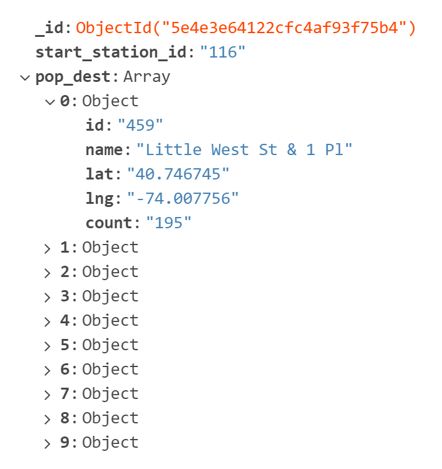
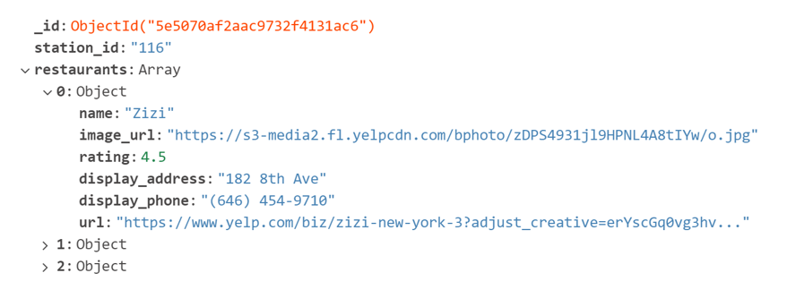

# **_Destination Station_**  

NYC Citi Bike and Yelp Querying App  

  

## Topic  
We would like to explore the city bike sharing system of New York City and popular trip destinations from particular stations. First, we’d like to map out the total amount of bike stations in an area, the subway stations, and the subway lines. App users can click on a bike-station nearby to start from, and the app will highlight the 10 most popular destinations based on the "Citi Bike Trip Histories" data set. App users can click on any destination-station, to investigate why it is popular, and get a list of restaurants and other attractions in the area; encouraging users to rent a bike and make a trip.  

## Data Sources and Technologies  
* [Citi Bike Trip Histories](https://www.citibikenyc.com/system-data)  
* [Map Visualization](https://docs.mapbox.com/api/maps/)  
* [Attraction/Business Queries](https://www.yelp.com)  
* MongoDB, Python, Pandas, PyMongo, Flask, HTML, CSS, Bootstrap, Javascript, Leaflet  

## Data Prep  

* The original million+ record data set was queried to make a smaller collection of only all the unique bike stations, containing ID, NAME, LATITUDE and LONGITUDE. This was used to plot base map containing all bike stations. An example of the resulting mongoDB collection is pictured below.   
  

* A second collection was prepared with all the bike stations, containing the ID and the 10 most popular destination stations from that station. This was used to plot an overlay of the 10 most popular destination stations. The overlaid destinations will vary in color and opacity based on relative popularity. An example of the resulting mongoDB collection is pictured below.  
  

* Yelp was used to query atrractions within a half of a mile of each bike station, based on the stations latitude and longitude. This was used to list attractions below the map for the chosen destination station. An example of the resulting mongoDB collection is pictured below.  
   

* Static database collections were chosen for a significantly faster loading app:  
	- The cost of not having live data was deemed minimal, as the need for live data for this application was not essential (business data not changing on that fine of a scale)  
	- Database collections can easily be updated periodically throughout the year  

## Backend  
A Flask API:  
* connects to the Mongo database using PyMongo  
* routes to and renders the HTML and Javascript templates  
* and injects the appropriate data.

## Frontend

## Future State  

## Current Hostable Site
* [Destination Station](https://code-sparrow.github.io/Destination-Station/hostable_site/)

## Contributors 
* __Claudia Palmer-Martinez:__ [github](https://github.com/Claud50623)
* __Alexandra Solano:__ [github](https://github.com/alexsolano36)
* __Donatienne Noel:__ [github](https://github.com/donatiennenoel)
* __John S. Chapek:__ [github](https://github.com/code-sparrow)